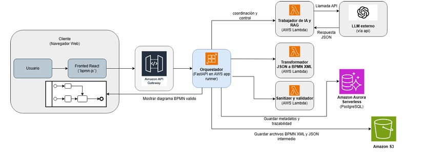

# SmartBPM Demo

SmartBPM is a full-stack academic demo that transforms natural-language process descriptions into visual, standards-compliant BPMN 2.0 diagrams. It combines a Spring Boot orchestration backend with a React/Vite frontend, applying RAG-enriched prompting, deterministic XML compilation, structural validation, and explainable optimization heuristics — all deployable on AWS (App Runner + Aurora PostgreSQL + S3).

## System Architecture



*This diagram illustrates the cloud-native architecture of SmartBPM, showing the orchestration flow from the React frontend through AWS API Gateway to the backend services, including AI generation, BPMN transformation, and validation.*

---

## Repository Structure

```
smartbpm-demo/
├── smartbpm-demo-backend/   # Spring Boot REST API & orchestration core
├── smartbpm-demo-frontend/  # React + Vite + TypeScript UI
└── docs/
    └── SMARTBPM_AWS_INTEGRATION.md  # Full AWS architecture & deployment guide
```

---

## Getting Started

These instructions will get a copy of the project up and running on your local machine for development and testing purposes. See the [Deployment](#deployment) section for notes on how to deploy it on a live system.

### Prerequisites

| Tool | Version |
|------|---------|
| Java | 21 |
| Maven | 3.9+ |
| Node.js | 20+ |
| npm | 10+ |
| Docker *(optional)* | 24+ |

> **OpenAI API key** — required only if you want live AI calls (`gpt-4o-mini`). The backend defaults to a deterministic fake-AI mode when no key is supplied.

### Installing

**1. Clone the repository**

```bash
git clone https://github.com/daviidc29/smartbpm-demo
cd smartbpm-demo
```

**2. Start the backend**

```bash
cd smartbpm-demo-backend
mvn spring-boot:run
```

The API will be available at `http://localhost:8081`.

**3. Start the frontend** *(new terminal)*

```bash
cd smartbpm-demo-frontend
npm install
npm run dev
```

The UI will be available at `http://localhost:5173`.

**4. Generate your first process**

Open the browser, type a process description in plain language, and click **Generate**. For example:

> *"The employee submits a reimbursement request. The system validates the invoice. If the amount is below 500 it is automatically approved, otherwise the manager reviews it. Finance processes the payment and the employee is notified."*

The app generates an intermediate JSON, compiles it to BPMN 2.0 XML, renders the diagram, and shows validation results — all in a single click.

---

## Running the Tests

### Backend

```bash
cd smartbpm-demo-backend
mvn test
```

Spring Boot Test is used for integration-level coverage. Key test areas:

- **Compiler tests** — verify that valid intermediate JSON always produces well-formed BPMN XML.
- **Validation tests** — assert that structural rules (missing start/end events, orphan nodes, shape overlap) are caught correctly.
- **Optimizer tests** — confirm that each heuristic (redundancy removal, XOR gateway insertion, notification placement) produces the expected output diff.

### Frontend

The frontend does not include a test suite in this academic demo. Manual smoke testing is described in the individual [`smartbpm-demo-frontend/README.md`](smartbpm-demo-frontend/README.md).

---

## Deployment

The project is containerized and designed for AWS. See [`docs/SMARTBPM_AWS_INTEGRATION.md`](docs/SMARTBPM_AWS_INTEGRATION.md) for the full architecture diagram, service mapping, and step-by-step deployment guide.

**Quick Docker build (backend)**

```bash
cd smartbpm-demo-backend
docker build -t smartbpm-backend .
docker run -p 8081:8081 \
  -e OPENAI_API_KEY=<your-key> \
  -e AURORA_HOST=<host> \
  -e AURORA_PORT=5432 \
  -e AURORA_DB=smartbpm \
  -e AURORA_USERNAME=<user> \
  -e AURORA_PASSWORD=<pass> \
  smartbpm-backend
```

The container starts the Spring Boot app with `--spring.profiles.active=aws`, switching the datasource to Aurora PostgreSQL and the storage layer to Amazon S3.

---

## Built With

| Technology | Role |
|-----------|------|
| [Spring Boot 3.3](https://spring.io/projects/spring-boot) | Backend framework & REST API |
| [Spring Data JPA](https://spring.io/projects/spring-data-jpa) | Persistence layer |
| [H2 Database](https://h2database.com) | Embedded DB for local execution |
| [PostgreSQL](https://www.postgresql.org) | Production-grade DB (Aurora-compatible) |
| [AWS SDK for Java v2](https://docs.aws.amazon.com/sdk-for-java/latest/developer-guide/) | S3 storage & Lambda invocation |
| [React 18](https://react.dev) | Frontend UI framework |
| [Vite 5](https://vitejs.dev) | Frontend build tool |
| [TypeScript 5](https://www.typescriptlang.org) | Type-safe frontend code |
| [bpmn-js](https://bpmn.io/toolkit/bpmn-js/) | BPMN 2.0 diagram renderer |
| [jsPDF](https://github.com/parallax/jsPDF) + [svg2pdf.js](https://github.com/yWorks/svg2pdf.js) | Client-side PDF export |
| [Apache Commons Text](https://commons.apache.org/proper/commons-text/) | Text processing utilities |

---

## Contributing

1. Fork the repository.
2. Create your feature branch: `git checkout -b feature/my-feature`
3. Commit your changes: `git commit -m 'Add my feature'`
4. Push to the branch: `git push origin feature/my-feature`
5. Open a Pull Request and describe what you changed and why.

Please keep commits focused, include meaningful messages, and add or update tests for any logic changes.

---

## Versioning

We use [SemVer](https://semver.org/) for versioning. For the versions available, see the [tags on this repository](https://github.com/daviidc29/smartbpm-demo/tags).

---

## Authors

- **Camilo Andres Fernandez** 
- **David Santiago Castro** 
- **Juan Jose Mejia**

---

## License

This project is licensed under the MIT License — see the [LICENSE](LICENSE) file for details.

---

## Acknowledgments

- [bpmn.io](https://bpmn.io/) for the open-source BPMN rendering toolkit.
- [OpenAI](https://openai.com/) for the language model API used in AI-assisted generation.
- The OMG BPMN 2.0 specification for standardized process modeling notation.
- Course instructors and peers for feedback on the architecture and demo scope.
